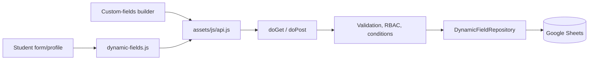

# Dynamic Custom Fields

## การวิเคราะห์ระบบเดิม

Frontend เป็น GitHub Pages แบบ HTML/Vanilla JavaScript และเรียก Google Apps Script Web App ผ่าน `fetch` ใน `assets/js/api.js` ส่วน backend ใช้ `doGet`/`doPost` ใน `Code.gs` และเก็บข้อมูลหลักใน Google Sheets ตาราง `Students` โดยใช้ `StipNo` เป็นรหัสอ้างอิงนักเรียน

จุดที่เกี่ยวข้องกับความสามารถนี้คือ:

- `student-form.html` แสดงและบันทึกข้อมูลนักเรียน
- `student-profile.html` แสดงข้อมูลสำหรับอ่านและพิมพ์
- `settings.html` และ `assets/js/rbac.js` จัดการสิทธิ์
- `assets/js/i18n.js` จัดการภาษาไทยและอังกฤษ
- `Code.gs` ทำ routing, authentication, service และ repository
- `databasesetup.gs` ตรวจและติดตั้งโครงสร้างชีต

ระบบเดิมยังคงใช้คอลัมน์คงที่ใน `Students` ตามเดิม ความสามารถใหม่ไม่เพิ่ม ลบ หรือเปลี่ยนชื่อคอลัมน์ในชีตนี้

## สถาปัตยกรรมที่ใช้

การไหลของข้อมูลเป็นดังนี้:



ข้อมูลหลักและ metadata แยกจากกันอย่างชัดเจน:

| Sheet | หน้าที่ |
| --- | --- |
| `FormSections` | ส่วนของแบบฟอร์ม ชื่อสองภาษา ลำดับ เงื่อนไข สิทธิ์ และรูปแบบ single/repeatable |
| `CustomFieldDefinitions` | นิยามฟิลด์ ชนิด validation สิทธิ์ และสถานะ archive |
| `CustomFieldOptions` | ตัวเลือกของ select, multiselect และ radio พร้อมป้ายสองภาษา |
| `CustomFieldValues` | ค่าของ entity โดยอ้างอิง `EntityID`, `FieldID`, `RecordID` และสถานะ Active |
| `CustomFieldAuditLog` | ประวัติผู้ใช้ บทบาท การกระทำ ค่าเดิม ค่าใหม่ และผลลัพธ์ |

`FieldID`, `SectionID`, `OptionID`, `ValueID` และ `RecordID` เป็นรหัสคงที่ ค่า `FieldKey` และ `SectionKey` เปลี่ยนไม่ได้หลังสร้างเพื่อไม่ให้ข้อมูลเดิมเสียความสัมพันธ์

## ความปลอดภัยและความเข้ากันได้

- Backend ตรวจ session และ permission ทุก endpoint ของ custom fields
- `manageCustomFields` ควบคุมการสร้าง แก้ไข จัดลำดับ setup และ archive
- การอ่านและบันทึกค่าตรวจสิทธิ์ของ entity, section, field และ role ซ้ำที่ backend
- Student อ่านและแก้ไขได้เฉพาะ `StipNo` ของตนเอง ส่วนข้อมูลหลักของ Student ถูกกรองด้วย allowlist ฝั่ง server
- ค่าใหม่ผ่าน type validation, length/range, option allowlist, safe regular expression, unique validation และ formula-injection protection
- UI สร้างข้อความ metadata ด้วย DOM `textContent` เพื่อป้องกัน HTML injection
- การเขียนใช้ `LockService`, batch write, schema cache และ audit log
- การ archive ไม่ลบ definition หรือ values เดิม การลบ repeatable record เปลี่ยนค่าเป็น inactive และบันทึก audit
- หากยังไม่ติดตั้ง schema หรือยังไม่มี section หน้าฟอร์มและโปรไฟล์เดิมยังทำงานได้ตามปกติ

## Setup และ rollback

หน้า `custom-fields.html` แสดง dry-run จาก `previewDynamicFieldSetup()` ก่อน setup ผู้ใช้จะเห็นชีตที่ขาด หัวคอลัมน์ที่ขาด และจำนวนแถวเดิม

`setupDynamicFieldSheets()` ทำเฉพาะสองอย่าง:

1. สร้างชีตที่ยังไม่มี
2. เพิ่มหัวคอลัมน์ที่ขาดต่อท้ายชีตเดิม

ฟังก์ชันนี้ไม่เรียก `clear()`, `deleteRow()`, `deleteColumn()` หรือ `deleteSheet()` การ rollback ของฟิลด์ให้ใช้ archive ส่วน rollback ของ feature ทำได้โดยนำ script `dynamic-fields.js` และ container ออกจากหน้าเดิม โดยข้อมูลหลักใน `Students` ไม่ได้รับผลกระทบ

## การเพิ่มฟิลด์ผ่านหน้าจอ

1. เปิด **ตั้งค่าระบบ → ช่องข้อมูลเพิ่มเติม**
2. ตรวจสถานะ schema และติดตั้งส่วนที่ขาดเมื่อระบบแจ้ง
3. สร้าง section พร้อมชื่อไทย/อังกฤษ สิทธิ์ และ cardinality
4. สร้าง field เลือกชนิด validation ตัวเลือก สิทธิ์ และเงื่อนไข
5. เปิดฟอร์มหรือโปรไฟล์นักเรียนเพื่อตรวจผล

เงื่อนไขรองรับ `equals`, `not_equals`, `contains`, `in`, `not_in`, `is_empty` และ `is_not_empty` โดยเลือกอ้างอิงข้อมูลหลักหรือ `FieldID` ของ custom field

## i18n สำหรับงานต่อจากนี้

ข้อกำหนดบังคับสำหรับ UI ใหม่อยู่ใน `AGENTS.md` ที่ root ของ repository ทุกข้อความที่ผู้ใช้เห็นต้องมี key ตรงกันใน `T.th` และ `T.en` ของ `assets/js/i18n.js` การสลับภาษาต้องรักษาค่าฟอร์มและห้ามเรียก API ซ้ำเพียงเพื่อแปลข้อความ

ก่อน commit ให้รัน:

```sh
node --test tests/i18n.test.cjs tests/dynamic-fields.test.cjs
git diff --check
```

เมื่อแก้ renderer หรือการสลับภาษา ให้รัน browser suite ตาม `tests/README.md` เพิ่มเติม
